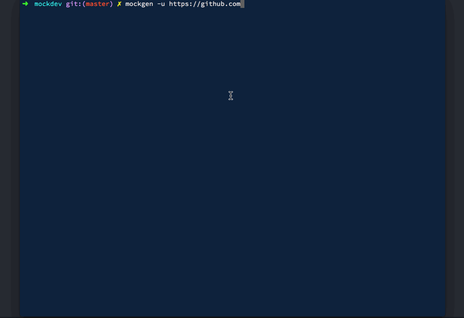

# mockgen 

Generates device mockups for a given URL using Puppeteer and Facebook Devices.

### Install

* Run `npm install -g mockgen`.
* Download and extract [Facebook Devices](https://facebook.design/devices).

### Usage

Run `mockgen -u URL` to generate a mockup for the given URL.

### Flags

* `-a, --assets` - Path to folder that contains Facebook Devices. Defaults to the current directory. Example, `~/Downloads`.
* `-d, --device` - Optional. The device for which you want a mockup. If not passed, a menu will be displayed with the list of available devices.
* `-s, --shadows` - Optional, defaults to true. If the base images used for the mockups should have shadows.
* `-u, --url` - The URL of the website that you wish to mockup.
* `-h, --help` - Get the list of flags.
* `-v, --version` - Get the current version of mockgen.

### Screenshot

### FAQ

**Will more devices be supported?**

Yes, I will be adding more devices gradually. The reason for this is that the base images have x and y offsets which need to be calculated. You are welcome to contribute :)

**Will landscape mode be supported?**

Yes, once support rotating images is available in [merge-images](https://github.com/lukechilds/merge-images). I have started working on it.

**Why is Facebook Devices not bundled with mockgen?**

Facebook's TOC are a little vague but from what I understand, it prohibits people from repackaging and redistributing.